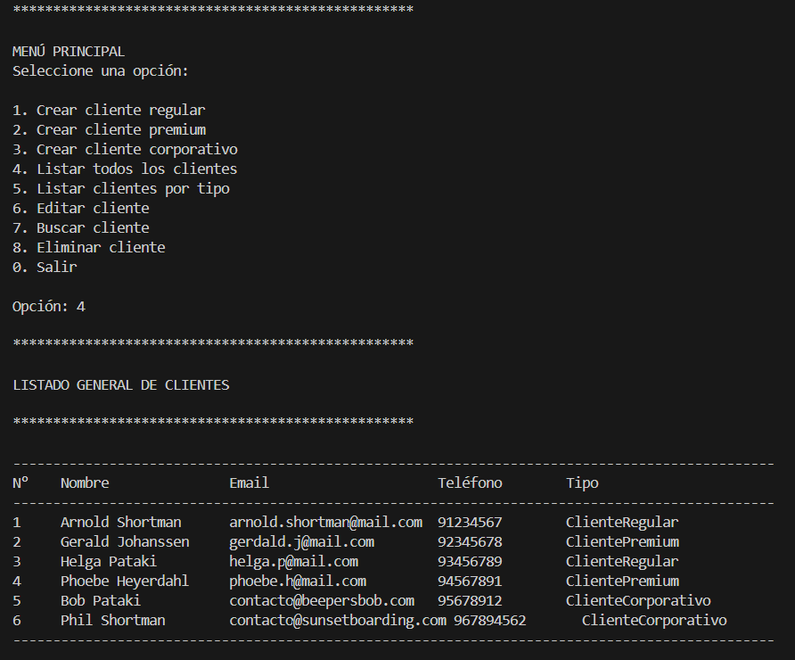

# Gestor Inteligente de Clientes(GIC)
Proyecto desarrollado en Python versión 3.14.2. 
Su objetivo es aplicar Programación Orientada a objetos(POO), herencia, polimorfismo validaciones, persistencia en archivos JSON.

## Arquitectura del proyecto
El sistema está organizado en las siguientes capas:

- **data/** -> Archivo JSON con los clientes creados.
- **docs/** -> Diagrama en archivo png y puml, pregunta. 
- **logs/** -> Archivo de registro del sistema.
- **models/** -> Clases del dominio(Cliente y sus tipos).
- **services/** -> Lógica de negocio(GestorCLientes).
- **utils/** -> Utilidades(validaciones, persistencia, logs, entrada de datos). 

- **main.py** -> Interfaz de usuario por consola. 

ABP4/
│
├── main.py
├── README.md
│
├── data/
│   └── clientes.json
│
├── docs/
│   ├── diagrama_classes_gic.png
│   ├── diagrama_classes_gic.puml
│   └── pregunta.md
│
├── logs/
│   └── app.log
│
├── models/
│   ├── __init__.py
│   ├── cliente.py
│   ├── cliente_regular.py
│   ├── cliente_premium.py
│   └── cliente_corporativo.py
│
├── services/
│   ├── __init__.py
│   └── gestor_clientes.py
│
└── utils/
    ├── __init__.py
    ├── archivo_json.py
    ├── entrada_usuario.py
    ├── excepciones.py
    ├── validaciones.py
    └── logger.py

## Tipos de clientes
Todos heredan de la clase padre `Cliente`
- ClienteRegular (descuento 0%)
- ClientePremium (descuento 20%)
- ClienteCorporativo (incluye empresa)

## Funcionalidades implementadas
- Crear clientes: Crea un nuevo cliente que puede ser regular, premium o corporativo.
- Listar todos los clientes: Lista todos los clientes creado, independiente del tipo.
- Listar clientes por tipo: Lista los clientes según el tipo seleccionado.
- Editar cliente: Permite editar exclusivamente los datos necesario, el resto de los datos se puede dejar en blanco y se entiende que no es necesario modificarlos.
- Buscar cliente: Busca los clientes por email o teléfono. 
- Eliminación de cliente: Elimina los clientes creados por número de cliente, muestra una "tabla" con los clientes creados y los elimina, previa confirmación para evitar eliminar un cliente por error.
- Validación de datos: Valída inmediatamente los datos a medida que se ingresa cada uno y no una vez que estén todos ingresados.
- Persistencia de datos: Persistencia automática, guardando los datos en JSON.
- Registro de acciones: Se registran acciones en logs.

## Ejecición del sistema
Desde la raiz del proyecto ejecutar: main.py

